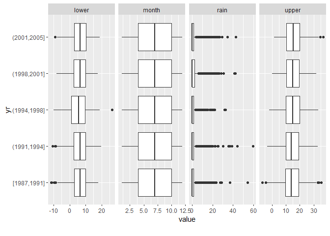
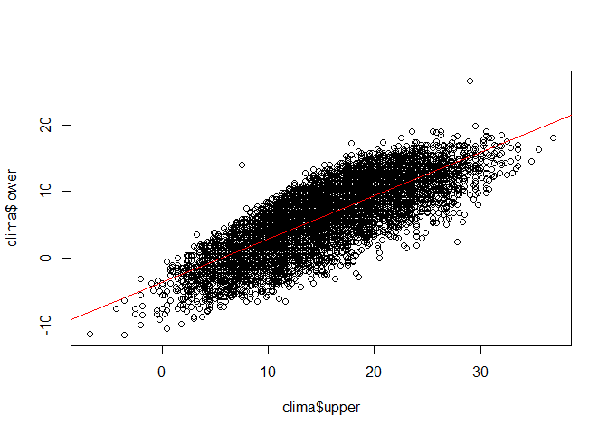

Manejo DataFrames 2
================

## Working Directory

``` r
setwd("~/AMV-21/Clase 2/DataFrame2")
```

## Llamado de Librerias

``` r
library(UsingR)
library(DataExplorer)
```

## Leyendo los datos

``` r
clima <- read.table("https://drvcruz.s3.us-east-2.amazonaws.com/SilwoodWeather.txt", header = T)
```

## Conociendo los datos

``` r
names(clima)
```

    ## [1] "upper" "lower" "rain"  "month" "yr"

``` r
attach(clima)
head(clima)
```

    ##   upper lower rain month   yr
    ## 1  10.8   6.5 12.2     1 1987
    ## 2  10.5   4.5  1.3     1 1987
    ## 3   7.5  -1.0  0.1     1 1987
    ## 4   6.5  -3.3  1.1     1 1987
    ## 5  10.0   5.0  3.5     1 1987
    ## 6   8.0   3.0  0.1     1 1987

``` r
str(clima)
```

    ## 'data.frame':    6940 obs. of  5 variables:
    ##  $ upper: num  10.8 10.5 7.5 6.5 10 8 5.8 2.8 -0.8 1.5 ...
    ##  $ lower: num  6.5 4.5 -1 -3.3 5 3 -3.3 -5.5 -4.8 -1 ...
    ##  $ rain : num  12.2 1.3 0.1 1.1 3.5 0.1 0 0 0 0 ...
    ##  $ month: int  1 1 1 1 1 1 1 1 1 1 ...
    ##  $ yr   : int  1987 1987 1987 1987 1987 1987 1987 1987 1987 1987 ...

## Factor Analisis

``` r
plot_boxplot(clima, by="month")
```

<!-- -->

``` r
plot_boxplot(clima, by="yr")
```

<!-- -->

## plot

<https://www.datamentor.io/r-programming/plot-function/>
<https://r-coder.com/plot-r/#Plot_line_type>
<https://bookdown.org/yihui/rmarkdown/pdf-document.html>

``` r
month<-factor(month)
plot(month,upper, xlab="Mes del Año", ylab="mm de lluvia")
text(7, 11, "Maximo")
```

<!-- -->

``` r
data(homeprice)
plot(homeprice$sale,homeprice$list)
abline(lm(homeprice$list~homeprice$sale), col="red")
```

<!-- -->
